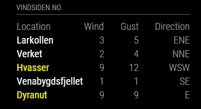

# MagicMirror² Module: Vindsiden
'MMM-Vindsiden' is a module for displaying weather data from vindsiden.no on a [MagicMirror²](https://magicmirror.builders/). It's using data from [vindsiden.no].

 

Current version is 1.0.0 See [changelog](CHANGELOG.md "Version history") for version history.

## Installation

Remote to your MM2-box with your terminal software and go to your MagicMirror's Module folder:
````bash
cd ~/MagicMirror/modules
````

Clone the repository:
````bash
git clone https://github.com/erikmohn/MMM-vindsiden.git
````

Go to the modules folder:
````bash
cd MMM-Vindsiden
````

Install the dependencies:
````bash
npm install
````

Add the module to the modules array in the `config/config.js` file by adding the following section. You can change this configuration later when you see this works:
```
{
	module: 'MMM-Vindsiden',
	header: 'Vindsiden.no',
	position: 'top_left',
	config: {

		maxItems: 10,
		locations: [
			{
				locationId: "3010972"
			}
		]
	}
},
...

